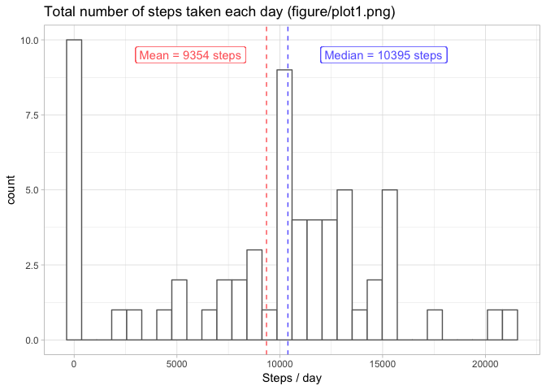
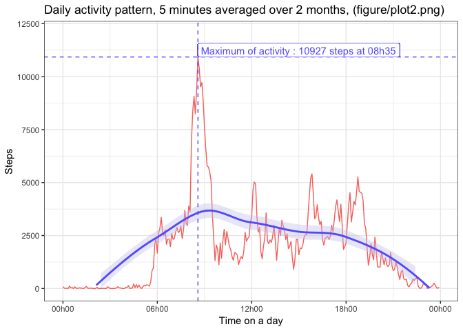
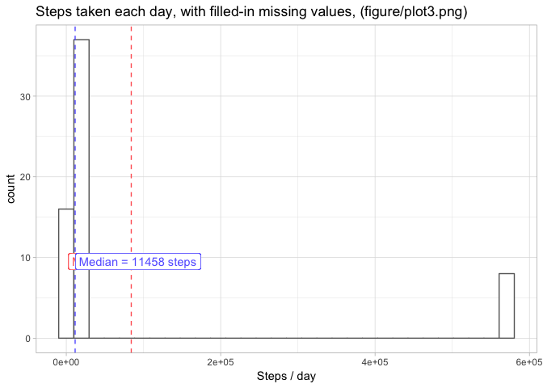
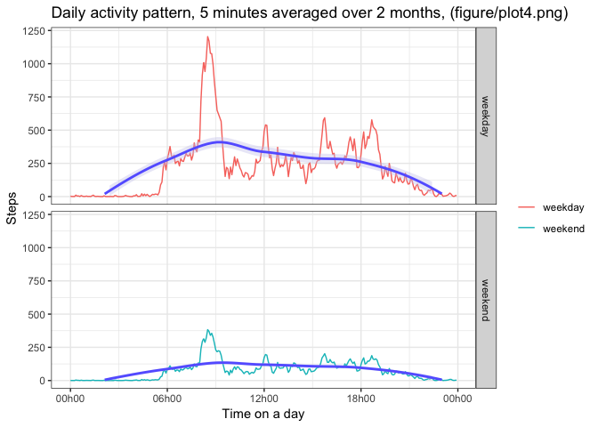

[Git repo : https://github.com/affagard/RepData_PeerAssessment1/](https://github.com/affagard/RepData_PeerAssessment1/), forked from [rdpeng](https://github.com/rdpeng/RepData_PeerAssessment1)


\  

\  

# Libraries required for this report

```r
library(dplyr)
library(ggplot2)
library(scales)
library(lubridate)
library(stringr)
library(knitr)
```

\  

\  

## Loading and preprocessing the data
- Data source URL : https://d396qusza40orc.cloudfront.net/repdata%2Fdata%2Factivity.zip [52K]
- Dataset : Data about personal movement using activity monitoring devices. The device collects data at 5 minutes interval through out the day. The data consists of two months of data from an anonymous individual collected during the months of October and November 2012. It includes the number of steps taken in 5 minutes interval each day.
\  

#### Init values

```r
        data_folder <- "data"
        fig_folder <- "figure"
        data_zip_name <- "activity.zip"
        data_url <- "https://d396qusza40orc.cloudfront.net/repdata%2Fdata%2Factivity.zip"
```
\  

#### Dowload data source if not already done

```r
        if(!file.exists(data_zip_name)) {
                
                download.file(data_url, destfile = data_zip_name, method = "curl")
                
        }
```
\  

#### Unzip data source if not already done

```r
        if(!dir.exists(data_folder)) {
                
                dir.create(data_folder, showWarnings = TRUE, recursive = FALSE, mode = "0744")
                unzip(data_zip_name, exdir = data_folder)
                
        }
```
\  

#### Create a local folder for figures

```r
        if(!dir.exists(fig_folder)) {
                
                dir.create(fig_folder, showWarnings = TRUE, recursive = FALSE, mode = "0744")
                
        }
```
#### Load activity dataset, (`activity`)

```r
        activity <- read.csv (paste(data_folder,"/activity.csv", sep=""), header=TRUE, sep = ",", dec=".")
```
\  

#### Tidy data : Column (`activity$date`) as date

```r
        activity$date <- as.Date(activity$date)
```
\  

#### Tidy data : Format column (`activity$interval`) as (`%H%M`) character pattern

```r
        activity$interval <- str_pad(as.character(activity$interval), 4, pad = "0")
```


\  

\  

## What is mean total number of steps taken per day?
#### Calculate total number of steps taken each day (`nb_steps_each_day`)

```r
        # Group by date and summarise per day
        nb_steps_each_day <- group_by(activity, date)
        # Summarise and set column names
        nb_steps_each_day <- summarise(nb_steps_each_day, steps_a_day = sum(steps, na.rm = TRUE))
        names(nb_steps_each_day) <- c("day", "steps_a_day")
```
\  

#### Horizontal line to draw for mean and median 

```r
        # Mean
        mean_total_nb_steps <- mean(nb_steps_each_day$steps_a_day)
        
        h_mean <- geom_hline(
                yintercept = mean_total_nb_steps,
                linetype = "dashed",
                color = "#ff6666"
        )

        text_mean <- geom_label(
                x = nb_steps_each_day$day[[1]],
                y = max(nb_steps_each_day$steps_a_day),
                hjust = "left",
                label = paste(
                        "Mean = ",
                        round(mean_total_nb_steps,0),
                        " steps",
                        sep=""
                ),
                color="#ff6666"
        )
        
        # Median
        median_total_nb_steps <- median(nb_steps_each_day$steps_a_day)
        
        h_median <- geom_hline(
                yintercept = median_total_nb_steps,
                linetype = "dashed",
                color = "#6666ff"
        )

        text_median <- geom_label(
                x = nb_steps_each_day$day[[1]],
                y = max(nb_steps_each_day$steps_a_day)-1500,
                hjust = "left",
                label = paste(
                        "Median = ",
                        round(median_total_nb_steps,0),
                        " steps",
                        sep=""
                ),
                color="#6666ff"
        )
```
\  

#### Histogram for **Total number of steps taken each day** (`nb_steps_each_day`)


```r
                g <- ggplot(
                        data = nb_steps_each_day,
                        aes(x = day, y = steps_a_day)
                )
                g <- g + geom_line(aes(color = "##ff6666"), show.legend = FALSE) + theme_bw()
                g <- g + ggtitle("Total number of steps taken each day (figure/plot1.png)")
                g <- g + ylab("Steps") + xlab("Days")
                g <- g + h_mean + h_median + text_mean + text_median
                g <- g + ylim(0,max(nb_steps_each_day$steps_a_day))
                print(g)
```

<!-- -->

- Mean total number of steps taken each day : **9 354 steps **

- Median total number of steps taken each day : **10 395 steps**

\  

\  

[File : figure/plot1.png](figure/plot1.png)

```r
                png(
                        filename = paste(fig_folder,"plot1.png",sep="/"),
                        width = 640,
                        height = 640,
                        units = "px",
                        pointsize = 12,
                        bg = "white"
                )
                print(g)
                dev.off()
```

```
## quartz_off_screen 
##                 2
```


\  

\  

## What is the average daily activity pattern?

The average daily activity pattern is figured with 

- A time series of the 5-minutes interval during a day on x-axis
- The average number of steps taken, averaged across all days on y-axis
- In follows, (`daily_activity`) is the data frame to get the daily activity pattern
\  

#### Group by interval and summarise per interval

```r
        daily_activity <- group_by(activity, interval)
        daily_activity <- summarise(daily_activity, steps_an_interval = sum(steps, na.rm = TRUE))
        str(daily_activity)
```

```
## Classes 'tbl_df', 'tbl' and 'data.frame':	288 obs. of  2 variables:
##  $ interval         : chr  "0000" "0005" "0010" "0015" ...
##  $ steps_an_interval: int  91 18 7 8 4 111 28 46 0 78 ...
```

#### Add a column with average number of steps taken, averaged across all days (`averaged_across_days`)
During the data frame period, there is **61 days**

```r
        daily_activity$averaged_across_days <- daily_activity$steps_an_interval/61
```
\  

#### Convert column interval into POSIXct

```r
        daily_activity$interval <- parse_date_time(daily_activity$interval, "HM") + months(9) + years(2012)
```
\  

#### Plotting average daily activity

We use ggplot2 library

First, we calculate the 5-minute interval containing the maximum steps

```r
max_average <- max(daily_activity$averaged_across_days)
interval_max_steps <- subset(daily_activity, averaged_across_days == max_average)
interval_max_steps_ftime <- date_format("%Hh%M")(interval_max_steps$interval)
```

The maximum number of steps averaged across days (rounded `max_average`) is **179 steps**, it happens at **08h35** (`interval_max_steps_ftime`)

\  

So we init a dash line (`hline`) and a text (`htext`) to point out in blue the maximum value of averages daily activity


```r
        hline <- geom_hline(
                yintercept = max_average,
                linetype = "dashed",
                color = "#6666ff"
        )

        vline <- geom_vline(
                xintercept = interval_max_steps$interval,
                linetype = "dashed",
                color = "#6666ff"
        )

        htext <- geom_label(
                x = interval_max_steps$interval,
                y = max_average,
                hjust = "left",
                vjust = "bottom",
                label = paste(
                        "Maximum of activity : ",
                        round(max_average,0),
                        " steps at ",
                        interval_max_steps_ftime,
                        sep=""
                ),
                color="#6666ff"
        )
```
\  

Then we set and print the ggplot instance, a png file is generated in folder figure


```r
        g <- ggplot(
                data = daily_activity,
                aes(x = interval, y = averaged_across_days)
        )
        g <- g + geom_line(aes(color = "red"), show.legend = FALSE) + theme_bw()
        g <- g + ylim(c(0,max(daily_activity$averaged_across_days)+10))
        g <- g + geom_smooth(method = "loess", color = "#6666ff", bg = "#ccccee")
        g <- g + ggtitle("Daily activity pattern, 5 minutes averaged over 2 months, (figure/plot2.png)")
        g <- g + ylab("Steps") + xlab("Time on a day")
        g <- g + scale_x_datetime(labels = date_format("%Hh%M"))
        g <- g + hline + htext + vline
        print(g)
```

<!-- -->

[File : figure/plot2.png](figure/plot2.png)

```r
        png(
                filename = paste(fig_folder,
                "plot2.png",sep="/"),
                width = 640,
                height = 640,
                units = "px",
                pointsize = 12,
                bg = "white"
        )
        print(g)
        dev.off()
```

```
## quartz_off_screen 
##                 2
```


\  

\  

## Imputing missing values

There is **2 304 missing values**, i.e. **13.11%** of the values, in the dataset `activity`

```r
        n_missing_values <- sum(is.na(activity$steps), na.rm = FALSE)
        print(n_missing_values)
```

```
## [1] 2304
```
\  

**Hypothesis and method to filled-in missing values :**

- We guess the best way to extrapolate missing steps (`NA` values) is to replace missing value by the average daily activity corresponding to its 5-minutes interval.

- We are alerted by the fact that 2 days have daily activity under 5% of the average daily steps, we could consider them as abnormal and decide to replace all of their interval steps values by their average daily activity. Nevertheless, in this report, we assume to not alter theses "surely-dummy" days.

- We set a new dataset (`activity_filled`) by replacing missing values of steps.

- Since (`NA`) steps data are replaced by decimal averages, we round them down to set a real case.
\  

\  

Replace the **2 304** `NA`values

```r
        activity_filled <- activity
        for( k in rep(1:length(activity$steps))){
                if(is.na(activity_filled$steps[[k]])){
                        activity_filled$steps[[k]] <- round(daily_activity$averaged_across_days[[1+k%%288]],0)
                }
        }
```
\  

Check total number of missing values in the new dataset (`activity_filled`)

```r
        print(sum(is.na(activity_filled$steps), na.rm = FALSE))
```

```
## [1] 0
```
\  

#### New Histogram for total number of steps taken each day, with filled-in missing values
Calculate the new total number of steps taken each day (`nb_steps_each_day`), summarise it and name columns

```r
        nb_steps_each_day <- group_by(activity_filled, date)
        nb_steps_each_day <- summarise(nb_steps_each_day, steps_a_day = sum(steps, na.rm = TRUE))
        names(nb_steps_each_day) <- c("day", "steps_a_day")
```
\  

Horizontal line to draw for mean and median 

```r
        # Mean
        mean_total_nb_steps <- mean(nb_steps_each_day$steps_a_day)
        
        h_mean <- geom_hline(
                yintercept = mean_total_nb_steps,
                linetype = "dashed",
                color = "#ff6666"
        )

        text_mean <- geom_label(
                x = nb_steps_each_day$day[[1]],
                y = max(nb_steps_each_day$steps_a_day),
                hjust = "left",
                label = paste(
                        "Mean = ",
                        round(mean_total_nb_steps,0),
                        " steps",
                        sep=""
                ),
                color="#ff6666"
        )
        
        # Median
        median_total_nb_steps <- median(nb_steps_each_day$steps_a_day)
        
        h_median <- geom_hline(
                yintercept = median_total_nb_steps,
                linetype = "dashed",
                color = "#6666ff"
        )

        text_median <- geom_label(
                x = nb_steps_each_day$day[[1]],
                y = max(nb_steps_each_day$steps_a_day)-1500,
                hjust = "left",
                label = paste(
                        "Median = ",
                        round(median_total_nb_steps,0),
                        " steps",
                        sep=""
                ),
                color="#6666ff"
        )
```


```r
        g <- ggplot(
                data = nb_steps_each_day,
                aes(x = day, y = steps_a_day)
        )
        g <- g + geom_line(aes(color = "#6666ff"), show.legend = FALSE) + theme_bw()
        g <- g + ggtitle(
                "Steps taken each day, with filled-in missing values, (figure/plot3.png)"
        )
        g <- g + h_mean + h_median + text_mean + text_median
        g <- g + ylab("Steps") + xlab("Days")
        g <- g + ylim(0,max(nb_steps_each_day$steps_a_day))
        print(g)
```

<!-- -->

[File : figure/plot3.png](figure/plot3.png)

```r
        png(
                filename = paste(fig_folder,
                "plot3.png",sep="/"),
                width = 640,
                height = 640,
                units = "px",
                pointsize = 12,
                bg = "white"
        )
        print(g)
        dev.off()
```

```
## quartz_off_screen 
##                 2
```

- Mean total number of steps taken each day : **10 581 steps **

- Median total number of steps taken each day : **10 395 steps**

\  
With filled-in missing values

- the median is the same,

- the mean is closer to the median.


\  

### Are there differences in activity patterns between weekdays and weekends?
\  

#### Add new column in (`activity_filled`)
day_type as.factor with 2 levels "weekday", "weekend"

```r
        # Add column day_type, init with "weekday"
        activity_filled$day_type <- "weekday"
        
        # For week end days, replace "weekday" by "weekend"
        activity_filled$day_type[which(wday(activity_filled$date, week_start = 1) %in% c(6,7))] <- "weekend"
```
\  

#### Daily activity pattern grouped by day_type

```r
        daily_activity <- group_by(activity_filled, interval, day_type)
        daily_activity <- summarise(daily_activity, steps_an_interval = sum(steps, na.rm = TRUE))
        # names(daily_activity) <- c("day", "day_type", "steps_a_day")
```
\  

#### Add a column with average number of steps taken, averaged across all days (`averaged_across_days`)
During the data frame period, there is **61 days**

```r
        daily_activity$averaged_across_days <- daily_activity$steps_an_interval/61
```
\  

#### Convert column interval into POSIXct

```r
        daily_activity$interval <- parse_date_time(daily_activity$interval, "HM") + months(9) + years(2012)
```
\  

#### Plotting average daily activity by comparing weekdays / weekends

```r
        g <- ggplot(
                data = daily_activity,
                aes(x = interval, y = averaged_across_days, color = day_type, group = day_type)
        )
        g <- g + geom_line(show.legend = TRUE) + theme_bw()
        g <- g + ylim(c(0,max(daily_activity$averaged_across_days)+10))
        g <- g + geom_smooth(method = "loess", color = "#6666ff", bg = "#ccccee")
        g <- g + ggtitle("Daily activity pattern, 5 minutes averaged over 2 months, (figure/plot4.png)")
        g <- g + ylab("Steps") + xlab("Time on a day")
        g <- g + scale_x_datetime(labels = date_format("%Hh%M")) + scale_color_discrete(name = "")
        g <- g + facet_grid(rows = vars(day_type))
        print(g)
```

<!-- -->

[File : figure/plot4.png](figure/plot4.png)

```r
                png(
                        filename = paste(fig_folder,"plot4.png",sep="/"),
                        width = 640,
                        height = 640,
                        units = "px",
                        pointsize = 12,
                        bg = "white"
                )
                print(g)
                dev.off()
```

```
## quartz_off_screen 
##                 2
```
